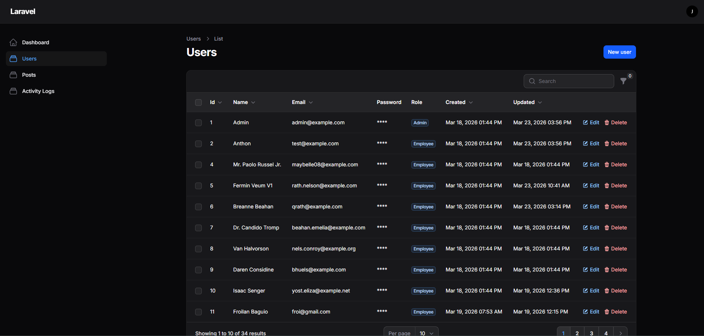
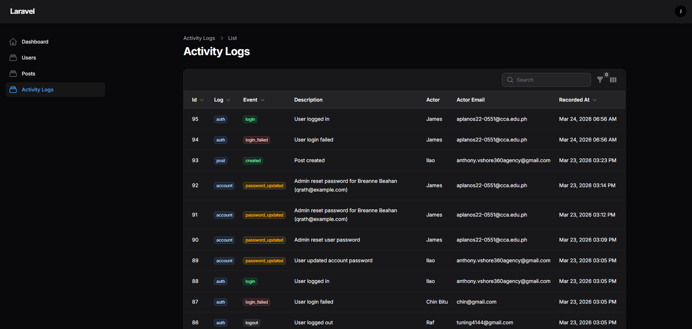
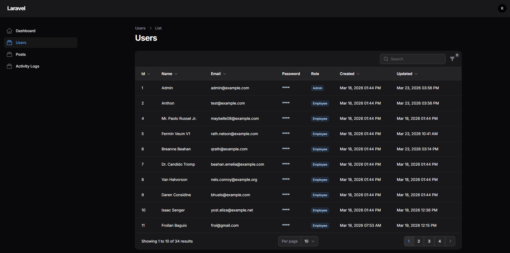
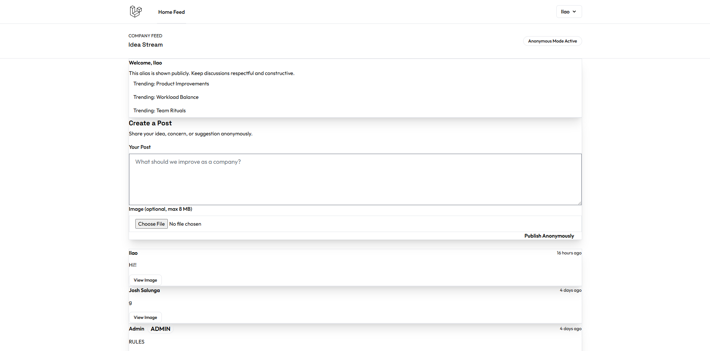

<h1 align="center">InternshipProject</h1>

Laravel application with Breeze authentication, Filament admin panel, Spatie roles and permissions, Livewire components, and activity logging.

---

## Features

- Authentication with Laravel Breeze
- Admin panel powered by Filament
- Roles and permissions with Spatie
- Activity and audit logging
- Soft deletes for posts

### Admin View

### Staff View

### Employee View

## Tech Stack

- PHP / Laravel
- MySQL
- Vite + NPM
- Tailwind CSS
- Livewire

## Prerequisites

Install these first:

- PHP 8.2+ (recommended)
- Composer 2+
- Node.js 18+ and NPM
- MySQL (XAMPP is supported)
- Git

Check your versions:

	php -v
	composer -V
	node -v
	npm -v
	mysql --version

## Quick Start (Windows / XAMPP Friendly)

1. Clone the repository

	git clone https://github.com/anthonyplanos/InternshipProject.git
	cd InternshipProject

2. Install backend and frontend dependencies

	composer install
	npm install

3. Create your environment file

	copy .env.example .env

4. Create a MySQL database

- Start Apache and MySQL in XAMPP
- Open phpMyAdmin: http://localhost/phpmyadmin
- Create a new database, for example: internship_project

5. Configure environment values in .env

Update these values to match your local database:

	DB_CONNECTION=mysql
	DB_HOST=127.0.0.1
	DB_PORT=3306
	DB_DATABASE=internship_project
	DB_USERNAME=root
	DB_PASSWORD=

6. Run Laravel setup

	php artisan key:generate
	php artisan migrate

7. Run the app

In terminal 1:

	php artisan serve

In terminal 2:

	npm run dev

Open: http://127.0.0.1:8000

## Quick Start (macOS / Linux)

	git clone https://github.com/anthonyplanos/InternshipProject.git
	cd InternshipProject
	composer install
	npm install
	cp .env.example .env
	php artisan key:generate

Then configure database values in .env and run:

	php artisan migrate
	php artisan serve
	npm run dev

## Common Issues

1. Vite manifest not found

Run:

	npm run dev

2. SQLSTATE access denied

Recheck DB_DATABASE, DB_USERNAME, DB_PASSWORD, and DB_PORT in .env.

3. Class or cache issues after pulling changes

Run:

	php artisan optimize:clear

4. APP_KEY missing

Run:

	php artisan key:generate

## Useful Commands

	php artisan migrate:fresh --seed
	php artisan test
	php artisan optimize:clear

## Notes

- All required packages are already defined in composer.json and package.json.
- Roles, permissions, Filament, and activity log dependencies are installed through Composer.
- Default MySQL port for XAMPP is 3306.

## License

This project is open-sourced software licensed under the MIT license.